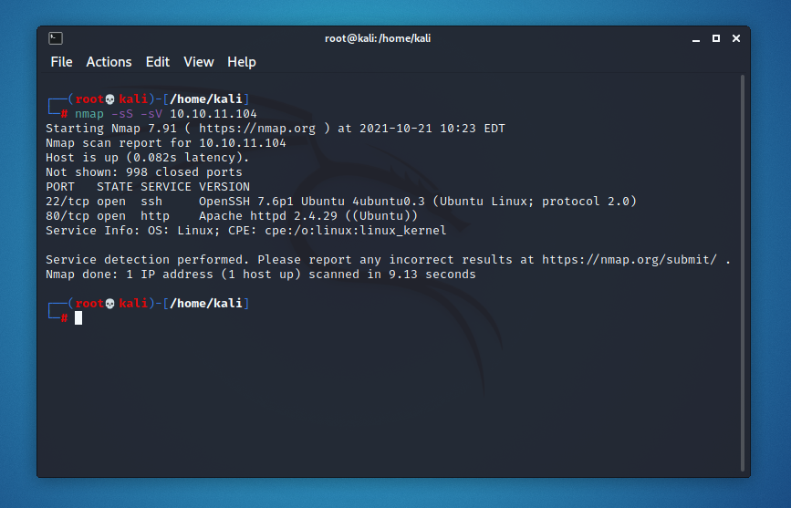
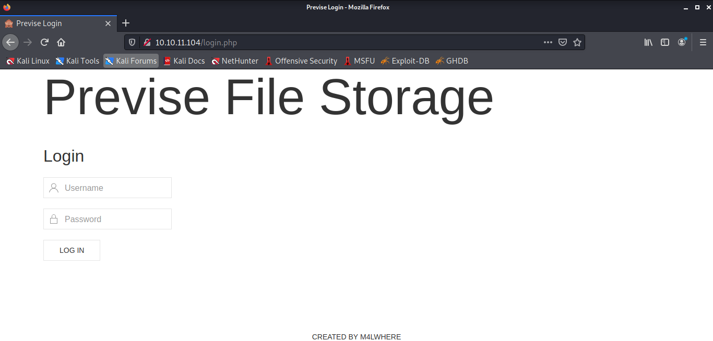
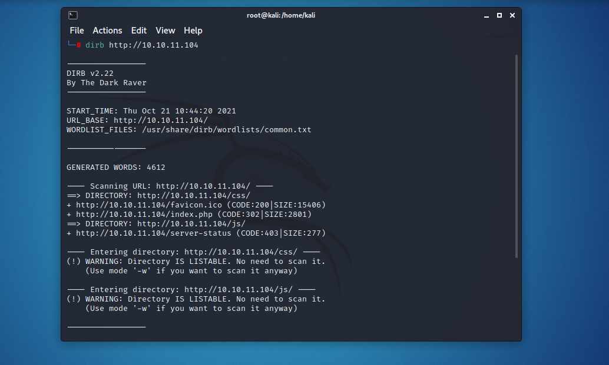
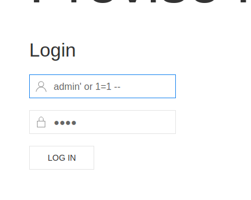

# Hackthebox-Previse-WriteUp
Selamat satang di repository saya, di sini saya akan menuliskan writeup pada machine **Previse**

Sebelum saya memulai laporan saya saya akan pemperkenalkan kepada anda apa itu penetration testing. Penetration Testing atau disebut juga pentest adalah pengujian keamanan informasi dimana seorang pentester meniru serangan yang biasa sering terjadi untuk mengidentifikasi metode peretasan fitur keamanan aplikasi, sistem, atau jaringan. Pengujian ini dilakukan oleh pentester menggunakan serangan yang nyata, sistem yang nyata, dan data yang nyata menggunakan alat dan teknik yang sering dipakai oleh seorang hacker. Penetration Testing biasanya dilakukan bersamaan dengan Vulnerability Assessment (VA). Vulnerability Assessment adalah sebuah proses untuk mengidentifikasi risiko dan celah kerentanan pada aplikasi, sistem, ataupun jaringan. Sebagian besar pentest mencari kombinasi kerentanan pada satu atau lebih sistem untuk mendapatkan akses lebih dalam pada sistem yang menjadi target dibandingkan dengan hanya mengetahui satu macam kerentanan.

### Scanning Port
---
Di sini saya menggunakan **nmap** untuk scan port yang terbuka untuk public 

setelah melakukan scan port diketahui bahwa terdapat 2 port yang terbuka untuk public, yaitu port 80 dan 22. Port 80 umumnya berfungsi untuk web site dengan http:// dan port 22 berfungsi untuk ssh server.

Setelah saya buka ternyata web tersebut berisi login page

### Bruteforce directory
---
Setelah itu saya melakukan brute force attack pada web menggunakan tool Bernama **dirb** untuk mengetahui apakah terdapat url lain yang dapat dibuka secara langsung tanpa autentikasi

Dan saya tidak bisa mendapat apa apa kerena langsung ke direct ke login page, namun saya dapat mengetahui direktori yang ada setelah melewati login page.

### SQL Injection
---
Lalu saya mencoba lagi menggunakan sql injection sederhana (sapa tau bisa yakan :v)

**BOOOM!** ndak bisa bro, cari jalan lain :')

### Burp Suite
---
Menggunakan aplkasi ini saya bisa
